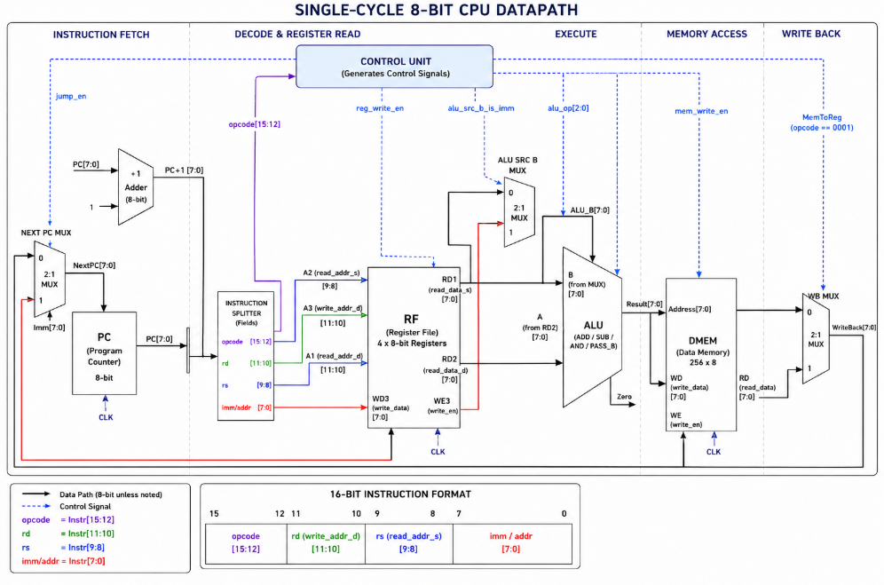
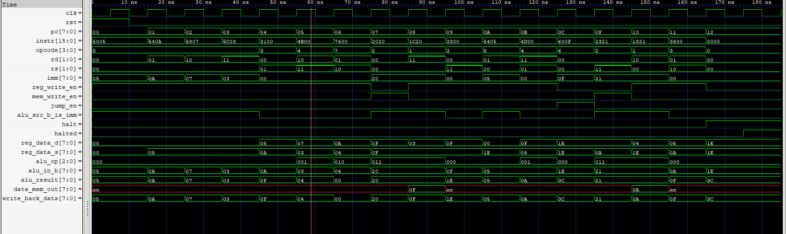

#  8-Bit Custom-Single-Cycle CPU (Verilog, Harvard Architecture)

 Repo: [8-bit-Single-Cycle-CPU](https://github.com/SAI-SRIVARDHAN-REDDY-LINGALA/8-bit-Single-Cycle-CPU/tree/main)

A custom-built 8-bit single-cycle CPU written from scratch in Verilog. Built for learning core CPU
design concepts — datapath, control unit, ALU, register file, and memory — as a stepping stone
toward a full RISC-V core.

---

##  Architecture Summary

| Feature             | Spec                                              |
|----------------------|----------------------------------------------------|
| Architecture         | Harvard (separate instruction & data memory)       |
| Data path width      | 8-bit                                               |
| Instruction width    | 16-bit, fixed format                                |
| Registers            | 4 general-purpose (R0–R3), 8-bit each               |
| Instruction memory   | 256 × 16-bit ROM                                    |
| Data memory          | 256 × 8-bit RAM                                     |
| Execution model      | Single-cycle (one instruction completes per clock)  |
| Instruction set      | 8 instructions                                      |
| Clock frequency      | 100 MHz testbench clock (10 ns period)              |

### Instruction Format (16-bit)

```
[15:12] opcode    (4 bits)
[11:10] rd        (2 bits) — destination register
[9:8]   rs        (2 bits) — source register
[7:0]   imm/addr  (8 bits) — immediate value or memory address (unsigned)
```

### Instruction Set

| Mnemonic | Opcode | Operation              |
|----------|--------|--------------------------|
| HALT     | 0000   | Stop the CPU             |
| LOAD     | 0001   | `Rd ← Mem[imm]`           |
| STORE    | 0010   | `Mem[imm] ← Rs`           |
| ADD      | 0011   | `Rd ← Rd + Rs`            |
| SUB      | 0100   | `Rd ← Rd − Rs`            |
| ADDI     | 0101   | `Rd ← Rd + imm`           |
| JMP      | 0110   | `PC ← imm`                |
| AND      | 0111   | `Rd ← Rd & Rs`            |

---

##  Datapath



- **ALU input A** is always `reg_data_d` (the destination register's current value).
- **ALU input B** is a mux: `imm` if `alu_src_b_is_imm = 1`, else `reg_data_s`.
- **Write-back MUX**: selects `data_mem_out` for LOAD, otherwise `alu_result`.
- All reads (register file, both memories) are **asynchronous** — combinational, no extra cycle.
- All writes (PC, register file, data memory) are **synchronous** — happen on `posedge clk`.

### Module List

| File                 | Role                                       |
|----------------------|---------------------------------------------|
| `alu.v`              | ADD / SUB / AND / PASS_B combinational ALU  |
| `register_file.v`    | 4 × 8-bit regs, async read, sync write      |
| `control_unit.v`     | Decodes opcode → control signals            |
| `instr_mem.v`        | 256 × 16-bit instruction ROM + test program |
| `data_mem.v`         | 256 × 8-bit data RAM                        |
| `cpu.v`              | Top-level CPU, wires everything together    |
| `cpu_tb.v`           | Testbench, clock gen, VCD dump, monitoring  |

### Control Signal Truth Table

| Instruction | reg_write_en | mem_write_en | jump_en | alu_src_b_is_imm | alu_op   |
|-------------|:---:|:---:|:---:|:---:|:---:|
| LOAD        | 1 | 0 | 0 | 1 | PASS_B |
| STORE       | 0 | 1 | 0 | 1 | PASS_B |
| ADD         | 1 | 0 | 0 | 0 | ADD    |
| SUB         | 1 | 0 | 0 | 0 | SUB    |
| ADDI        | 1 | 0 | 0 | 1 | ADD    |
| JMP         | 0 | 0 | 1 | X | X      |
| AND         | 1 | 0 | 0 | 0 | AND    |
| HALT        | 0 | 0 | 0 | X | X      |

---

##  Timing

Single-cycle critical path is dominated by LOAD (it touches memory twice):

```
T_c = t_pcq + t_mem + t_mux + t_ALU + t_mem + t_mux + t_RFsetup
    = 40   + 200   + 30    + 120   + 200   + 30    + 60       = 680 ps
```

Max theoretical clock: **~1.47 GHz**. (Testbench actually runs at 100 MHz for simulation clarity.)

---

##  How to Run

```bash
iverilog -o cpu_sim alu.v register_file.v control_unit.v instr_mem.v data_mem.v cpu.v cpu_tb.v
vvp cpu_sim
gtkwave cpu.vcd
```

Expected output: per-cycle `$display` trace of `PC`, `Instr`, `Opcode`, all 4 registers, and
`Mem[32]`/`Mem[33]`, ending in `CPU halted at time ...` once the HALT instruction is reached.

### Reading the GTKWave trace

Recommended signal order: `clk`, `rst` → `pc`, `instr` → `opcode`, `rd`, `rs`, `imm` →
control signals (`reg_write_en`, `mem_write_en`, `jump_en`, `alu_src_b_is_imm`, `halt`, `halted`) →
`reg_data_d`, `reg_data_s` → `alu_op`, `alu_in_b`, `alu_result` → `data_mem_out`, `write_back_data`.
Set buses to Hex and read top-to-bottom right after each `posedge clk`.



---

##  Known Limitations

- No conditional branching — only unconditional `JMP`, so backward jumps with no exit loop forever.
- Memory/register file contents start undefined (`x`) until written.
- Asynchronous memory reads aren't ideal for FPGA BRAM synthesis.
- Only 4 registers and 256-entry flat memory.

---

##  Future Improvements / Roadmap

- **Near-term:** Add `BEQ`/`BNE` using the existing `zero_flag`; initialize memory contents;
  make memory reads synchronous for FPGA BRAM compatibility.
- **Multi-cycle:** Add an FSM (FETCH→DECODE→EXECUTE→MEMORY→WRITEBACK) with internal pipeline
  registers — shorter clock period, but CPI rises to 3–5.
- **Pipelined:** Add IF/ID, ID/EX, EX/MEM, MEM/WB registers plus hazard forwarding — CPI → 1
  after pipeline fill.
- **RISC-V:** Widen to 32-bit, 32 registers, R/I/S/B/U/J formats, sign-extended immediates,
  full ALU op set, conditional branches — target GCC/LLVM toolchain compatibility.

---

##  Repo Structure

```
8-bit-cpu/
├── alu.v
├── register_file.v
├── control_unit.v
├── instr_mem.v
├── data_mem.v
├── cpu.v
├── cpu_tb.v
├── cpu.vcd            (generated)
├── images/
│   ├── architecture.png
│   └── waveform.png
└── README.md
```
